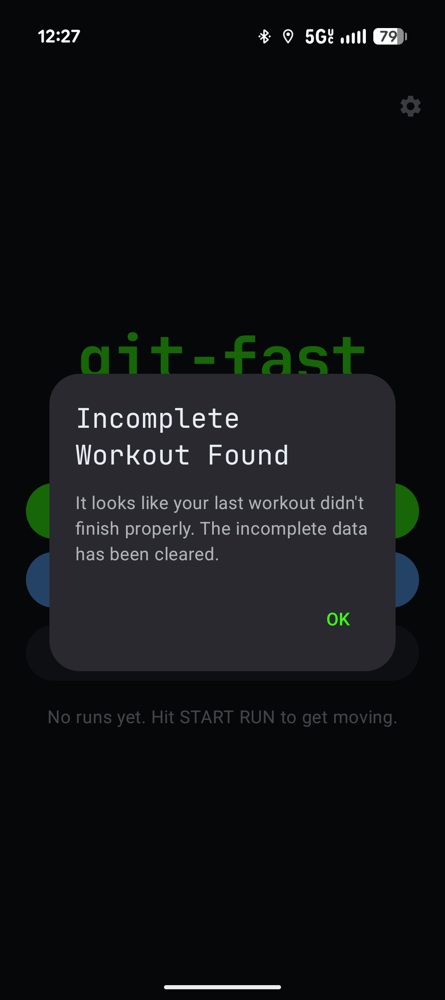
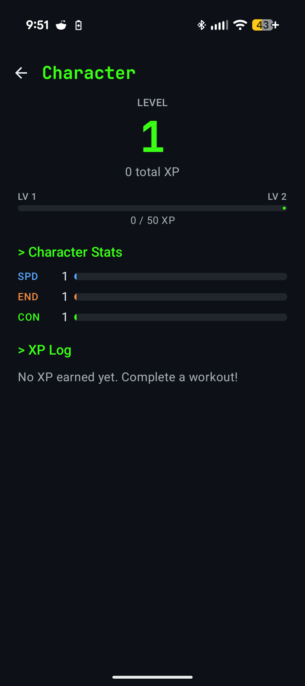
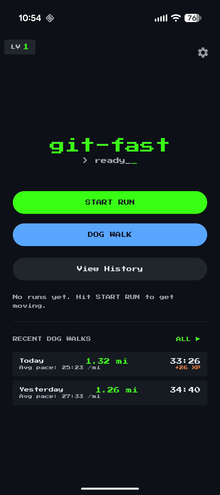
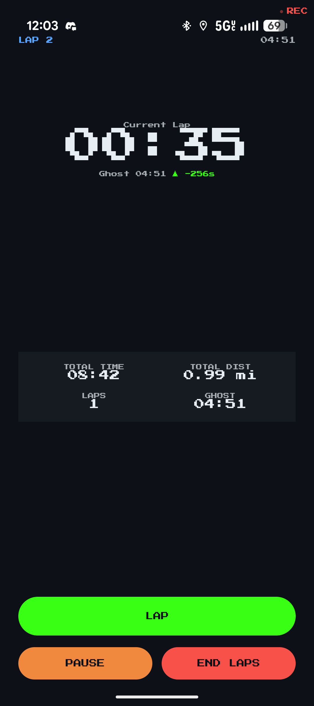
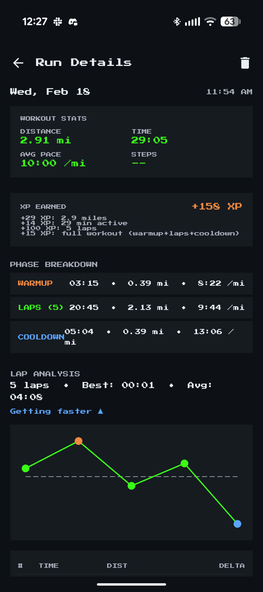
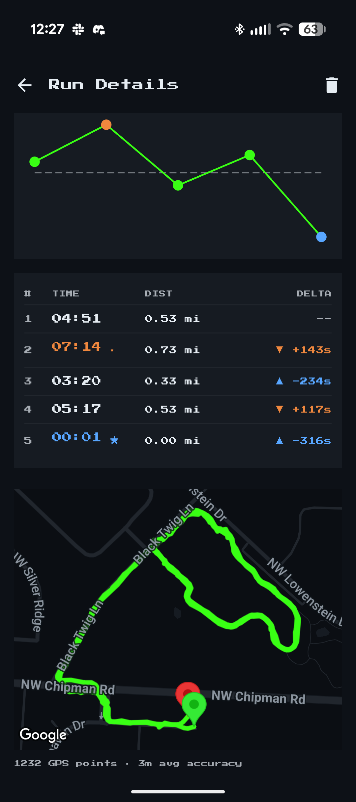
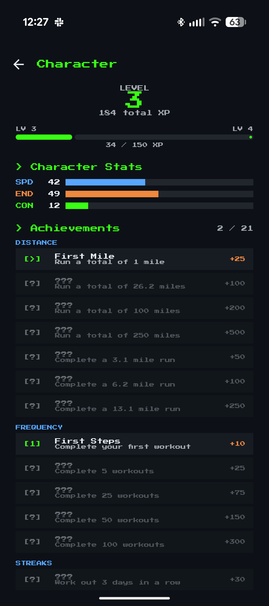
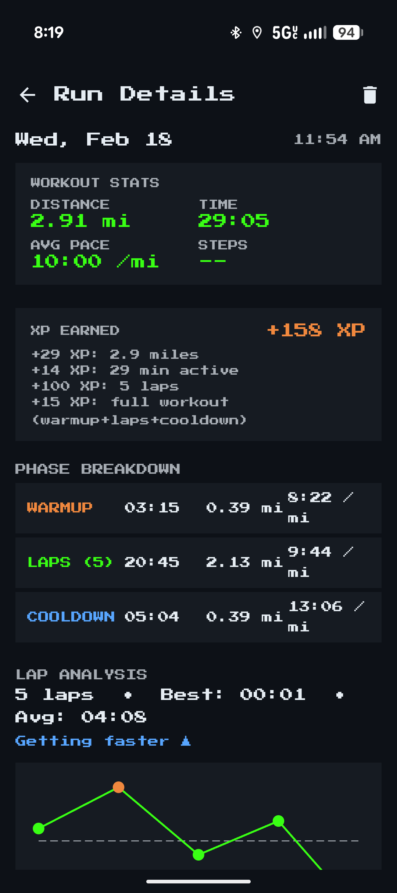
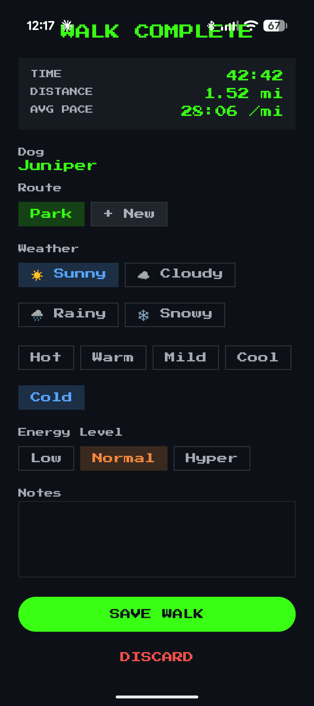

# Project Timeline

## Phase: Ideation & First Build
**Date:** Feb 16, 2026 to Feb 17, 2026
**Duration:** 2 days

git-fast started as a fitness tracking app with an RPG twist — turn real workouts into character progression. The idea was born from wanting to gamify dog walks and runs with XP, levels, and stat progression. Within 24 hours of creating the repo, the app had GPS tracking, dog walk recording, crash recovery, and a working character sheet.

### Screenshots

### Highlights
- GPS workout tracking with route visualization from day one
- Dog walk and run workout types
- RPG character sheet with stats (SPD/END/CON)
- Crash recovery dialog for interrupted workouts
- Dark retro terminal UI theme

### Metrics
- **Time to First Working App:** 1 day
- **Screens Built:** 6 (Home, History, Detail, Character Sheet, Settings, Active Workout)
- **GPS Points Tracked:** 521 on first walk

---

## Phase: XP System & Lap Mode
**Date:** Feb 18, 2026 to Feb 18, 2026
**Duration:** 1 day

Day 2 brought the core RPG mechanics to life. Added an XP system that rewards workouts, a lap mode with ghost runner comparison, phase breakdowns (warmup/laps/cooldown), and the iconic PressStart2P pixel font. The character sheet went from empty to earning real XP from completed workouts.

### Screenshots

### Highlights
- XP system with per-workout breakdown
- Lap mode with ghost runner time delta
- Phase breakdown (Warmup → Laps → Cooldown)
- Lap trend chart showing "Getting faster"
- Achievement system (First Mile, First Steps)
- PressStart2P pixel font for retro RPG aesthetic

### Metrics
- **Achievements Unlocked:** 2 of 21
- **Max Level Reached:** 3 (184 XP)
- **Lap Mode Features:** Ghost runner, delta tracking, trend chart

---

## Phase: Character Profiles & Pixel Art
**Date:** Feb 18, 2026 to Feb 20, 2026
**Duration:** 3 days

The character sheet evolved into a dual-profile system with pixel art avatars. Added separate tabs for the user (runner) and their dog (Juniper), each with their own level, stats, XP, and achievements. Walk completion form got weather chips, route selection, and energy level tracking.

### Screenshots

### Highlights
- Dual character profiles (Me + Juniper the dog)
- Pixel art avatars for runner and dog
- Streak tracking with XP multiplier
- Dog-specific achievements (0/6 category)
- Weather, route, and energy tracking on walk completion

### Metrics
- **Character Profiles:** 2 (Runner + Dog)
- **Achievement Categories:** Runner (21) + Dog (6)
- **Streak Multiplier:** 1.1x at 2-day streak

---

## Phase: Sprint Detection & Health Integration
**Date:** Feb 25, 2026 to Feb 25, 2026
**Duration:** 1 day

Added Dog Run as a new workout type with automatic sprint detection — the app detects when you're running fast and tracks sprint segments separately. Integrated with Android Health Connect for body composition syncing. Added Roborazzi screenshot testing for CI and navigate-away handling for active workouts.

### Highlights
- Dog Run workout type with auto sprint detection
- Live speed display during workouts
- Health Connect integration for body composition data
- Screenshot testing with Roborazzi in CI pipeline
- Navigate-away protection with return banner
- Android Lint integration in CI

### Metrics
- **PRs Merged (this phase):** 12
- **New Workout Type:** Dog Run with sprint tracking
- **CI Checks Added:** Lint + Screenshot verification

---

## Phase: Adventure Log & Weekly Stats
**Date:** Feb 26, 2026 to Feb 28, 2026
**Duration:** 3 days

The most feature-rich phase. Added Juniper's Adventure Log — a dog walk event logger with emoji map markers and a radial event wheel. Built a weekly summary card for the home screen. Introduced exercise data model with RPG stat integration, soreness check-in with toughness tracking, and status bar chronometer. The app narrative was rewritten for an epic RPG tone.

### Highlights
- Dog walk event logger (Juniper's Adventure Log) with emoji map markers
- Radial event wheel FAB replacing the event strip
- Weekly summary card on home screen
- Exercise data model with RPG stat integration
- Soreness check-in system with toughness stat
- Status bar chronometer showing workout time
- Epic narrative rewrite across the app

### Metrics
- **Total PRs Merged:** 100
- **Checkpoints Completed:** 23
- **Screenshot Comparisons:** 6 dated folders
- **Event Types:** Dog walk events with emoji markers
