# Project Timeline

## Phase: Planning & Architecture
**Date:** Feb 10, 2026 to Feb 16, 2026
**Duration:** 6 days

git-fast was born in Claude.ai's project space before a single line of code was written. Over 9 planning sessions, the app evolved from a nameless "workout application" concept to a fully specced project with 14 markdown spec documents, architecture diagrams, and a 10-checkpoint build plan. The app started life as **FlexFile**, went through a brainstorming phase (LapLog, PaceFile, RunTrace...), and landed on **git-fast** — part of a planned `git + verb` ecosystem. Key architectural bets were made early: Kotlin/Compose/MVVM/Hilt/Room, dark retro terminal aesthetic, phone-first MVP with T-Watch S3 BLE later, and a 5-agent CLI strategy mapped out for implementation.

### Planning Sessions
| Date | Session | Key Outcome |
|------|---------|-------------|
| Feb 10 | Project Inception | Initial concept as "FlexFile": Android + T-Watch S3 via BLE, 5-agent CLI strategy |
| Feb 11 | App Name Brainstorming | Explored LapLog, PaceFile, RunTrace, SplitSheet — no final decision |
| Feb 12 | Architecture & Name Finalized | **git-fast** chosen, full checkpoint plan (CP00–09), RPG system designed, all specs produced |
| Feb 12 | Project Space Organization | Clarified knowledge vs instructions in Claude.ai, drafted project instructions |
| Feb 14 | Reusable Templates | Extracted patterns into templates for future apps (git-tunes, etc.) |
| Feb 16 | Spec Bundle Handoff | All 14 spec files zipped for transfer to Claude CLI — planning complete |
| Feb 17 | Dog Walk Activity Type | Juniper walk tracking designed, schema baked into CP01 (no migrations needed) |
| Feb 17 | Enhanced Notification | Persistent status bar notification spec — no Stop button, 2-3s update interval |
| Feb 24 | Roborazzi Screenshot Testing | CI as golden image source of truth, small tolerance, flat organization to start |

### Notable Exchanges

**The name decision (Feb 12):**
> **Ryan:** "I was thinking it would be git fast. Because I'm thinking of naming all my projects with git as the start and then like, a verb."
>
> **Claude:** "That's a fun naming convention — 'git' as a prefix gives you a built-in developer aesthetic and a whole verb vocabulary to work with. 'Git Fast' works well for a running app specifically: it's punchy, the double meaning lands (version control + 'get fast'), and it fits the retro/terminal vibe you're going for."

**Phone-first MVP (Feb 12):**
> **Claude:** "Your architecture doc has Phase 1 starting with BLE connectivity, but your memory mentions starting with a phone-only MVP that can track GPS workouts immediately. Those are different starting points. The phone-first approach gets you a working app faster and doesn't block on watch firmware."

**RPG system origins (Feb 12):**
> **Claude:** "I'm thinking we add one more checkpoint — Checkpoint 10: RPG Foundation. Player profile, XP calculation from completed workouts, basic leveling, stat display derived from workout history."
>
> **Ryan:** *(chose Terminal RPG aesthetic — ASCII art meets character sheets)*
>
> **Claude:** "Terminal RPG aesthetic is perfect with the git-fast brand. Think character sheets rendered in monospace, ASCII progress bars for XP, box-drawing characters for stat displays."

**The poop emoji button (Feb 17):**
> **Ryan:** "To be able to compare, I guess, a bathroom break button on the watch. That'd be a funny addition. Especially if you can put like a little poop icon for it."
>
> **Claude:** "Ha, a poop emoji button on the watch — that's amazing. Mechanically it's similar to lap marking (tap → record GPS + timestamp), but it needs its own data model, watch UI, and map rendering (dropping pins with poop emojis on the route map). Genuinely fun feature but better as a follow-up."

**No Stop button in notification (Feb 17):**
> **Ryan:** "I don't want a Stop button in the notification — I've accidentally stopped workouts before."
>
> **Claude:** "Smart. We'll keep only Pause/Resume in the notification. The Stop action lives in the app UI where it's intentional, not a pocket-tap away."

**The migration revelation (Feb 17):**
> **Ryan:** "You don't need to worry about anything backwards compatibility, nothing is built yet."
>
> **Claude:** "Oh right, ha — good point. Instead of a migration from version 1→2, we should just bake the `activityType` and all the dog walk fields directly into the version 1 schema from the start. No migration code needed at all."

**Screenshot testing philosophy (Feb 24):**
> **Ryan:** "I was hoping... just before any changes are fully done, when it involves changing the screens in some manner, to run this and just always make sure it still produces."
>
> **Claude:** "Basically it becomes part of your development checklist: if you touch a composable, you run `recordRoborazziDebug` before you consider the work done, commit the updated goldens alongside the code change, and CI verify confirms everything matches."

### Highlights
- 9 planning sessions across 2 weeks — all in Claude.ai before touching Claude CLI
- 14 spec documents covering checkpoints 00–09 plus architecture, diagrams, Docker, and timeline
- App renamed 3 times: "workout app" → FlexFile → git-fast (`git + verb` ecosystem)
- Phone-first MVP chosen over BLE-first — get real data immediately, add watch later
- RPG system designed from the start — terminal aesthetic, character sheets, XP from workouts
- Dog walk activity (Juniper) designed pre-build — schema included from day one, no migrations
- Enhanced notification: live stats, no Stop button, activity-aware content, 2-3s updates
- Roborazzi screenshot testing planned: CI as source of truth, small tolerance, component-focused

### Metrics
- **Planning Sessions:** 9
- **Spec Documents Produced:** 14
- **Days from Idea to First Code:** 6
- **App Name Changes:** 3

---

## Phase: Ideation & First Build
**Date:** Feb 16, 2026 to Feb 17, 2026
**Duration:** 2 days

git-fast started as a fitness tracking app with an RPG twist — turn real workouts into character progression. The idea was born from wanting to gamify dog walks and runs with XP, levels, and stat progression. Within 24 hours of creating the repo, the app had GPS tracking, dog walk recording, crash recovery, and a working character sheet.

### Screenshots
 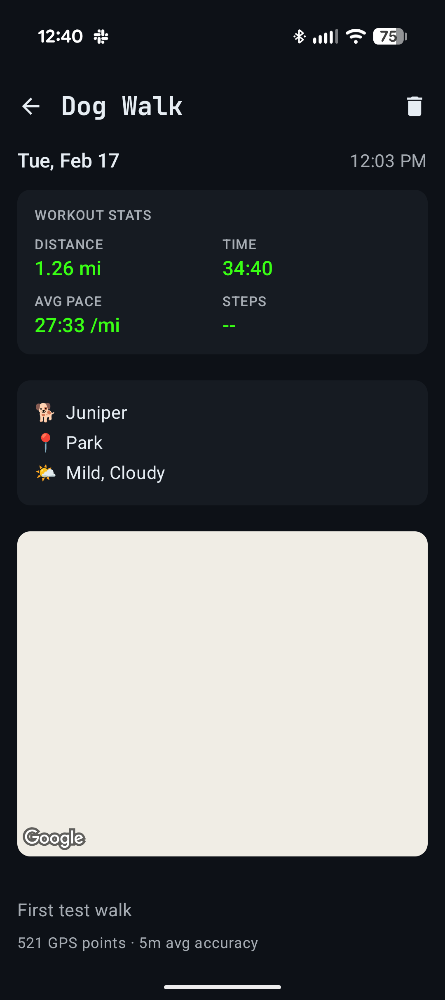 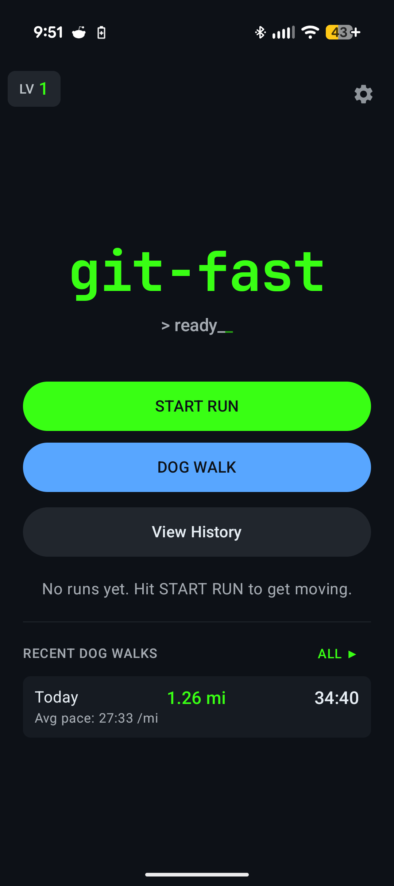 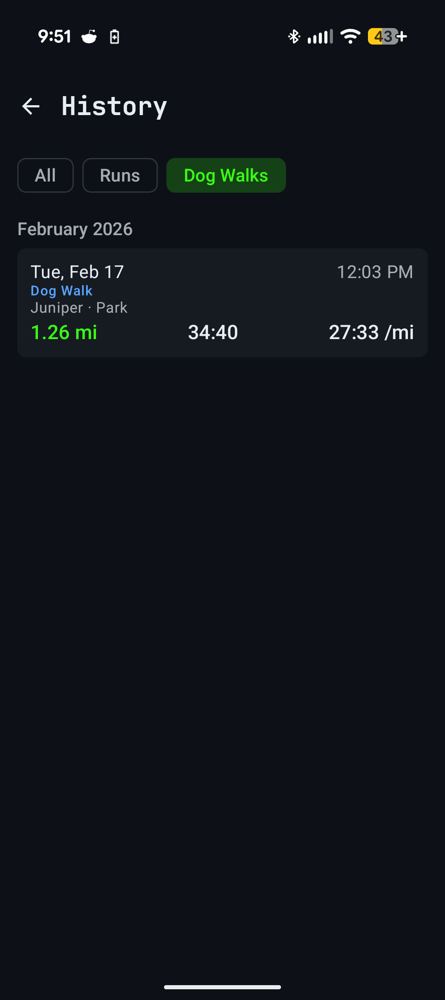 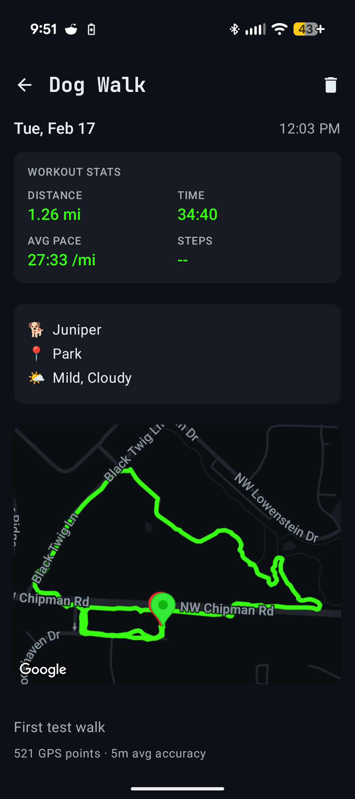  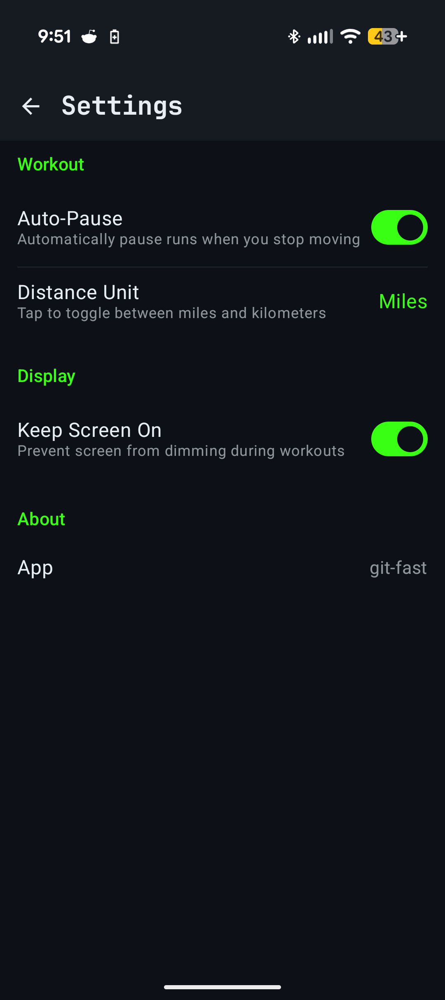

### Highlights
- GPS workout tracking with route visualization from day one
- Dog walk and run workout types
- RPG character sheet with stats (SPD/END/CON)
- Crash recovery dialog for interrupted workouts
- Dark retro terminal UI theme

### Metrics
- **Time to First Working App:** 1 day
- **Screens Built:** 6 (Home, History, Detail, Character Sheet, Settings, Active Workout)
- **GPS Points Tracked:** 521 on first walk

---

## Phase: XP System & Lap Mode
**Date:** Feb 18, 2026 to Feb 18, 2026
**Duration:** 1 day

Day 2 brought the core RPG mechanics to life. Added an XP system that rewards workouts, a lap mode with ghost runner comparison, phase breakdowns (warmup/laps/cooldown), and the iconic PressStart2P pixel font. The character sheet went from empty to earning real XP from completed workouts.

### Screenshots
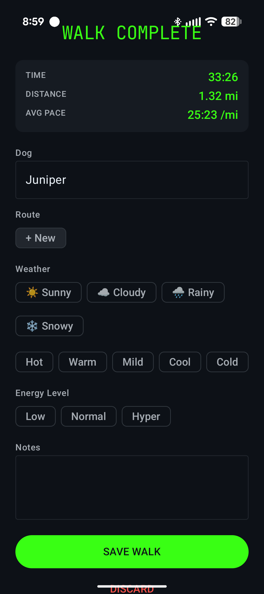  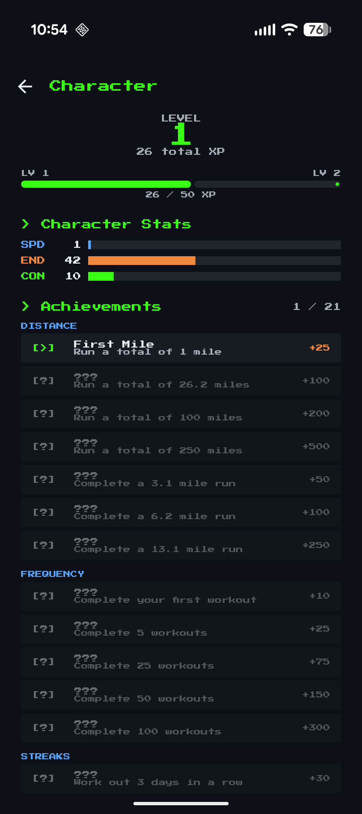    

### Highlights
- XP system with per-workout breakdown
- Lap mode with ghost runner time delta
- Phase breakdown (Warmup → Laps → Cooldown)
- Lap trend chart showing "Getting faster"
- Achievement system (First Mile, First Steps)
- PressStart2P pixel font for retro RPG aesthetic

### Metrics
- **Achievements Unlocked:** 2 of 21
- **Max Level Reached:** 3 (184 XP)
- **Lap Mode Features:** Ghost runner, delta tracking, trend chart

---

## Phase: Character Profiles & Pixel Art
**Date:** Feb 18, 2026 to Feb 20, 2026
**Duration:** 3 days

The character sheet evolved into a dual-profile system with pixel art avatars. Added separate tabs for the user (runner) and their dog (Juniper), each with their own level, stats, XP, and achievements. Walk completion form got weather chips, route selection, and energy level tracking.

### Screenshots
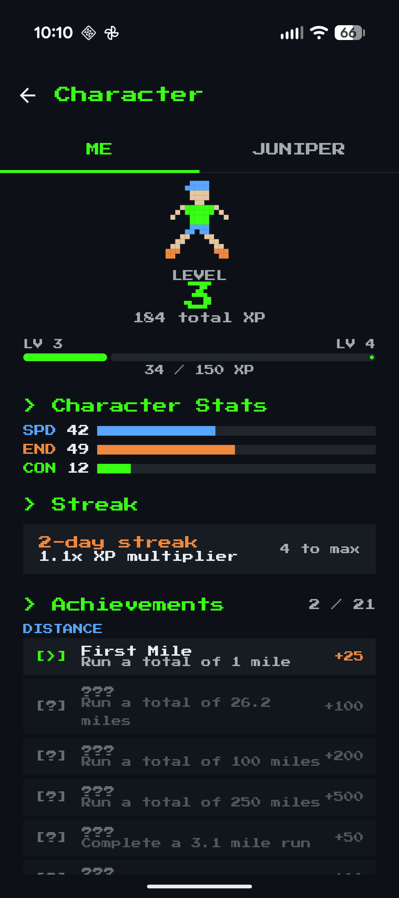 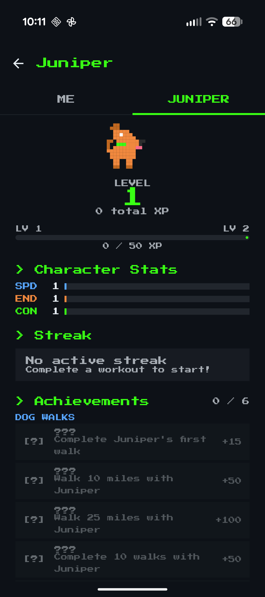  

### Highlights
- Dual character profiles (Me + Juniper the dog)
- Pixel art avatars for runner and dog
- Streak tracking with XP multiplier
- Dog-specific achievements (0/6 category)
- Weather, route, and energy tracking on walk completion

### Metrics
- **Character Profiles:** 2 (Runner + Dog)
- **Achievement Categories:** Runner (21) + Dog (6)
- **Streak Multiplier:** 1.1x at 2-day streak

---

## Phase: T-Watch S3 Firmware & The Bricking
**Date:** Feb 18, 2026 to Feb 23, 2026
**Duration:** 5 days

The first foray into watch firmware — and a hard lesson in ESP32 strapping pins. On Feb 18, a working splash screen firmware was flashed to the T-Watch S3 via PlatformIO (PR #38). Over the next few days, the firmware was expanded with a proper architecture: PMU initialization, display manager, screen system (splash, watch face, workout), mock data, and a suite of diagnostic tools. Then on Feb 23, GPIO0 got stuck LOW due to `PAD_HOLD` being set on the RTC domain — bricking the watch in download mode. GPIO0 is both the PDM microphone clock and a strapping pin; LILYGO's design choice to use it for the mic meant any PAD_HOLD on GPIO0-11 would freeze it LOW, forcing the ROM bootloader into download mode on every boot.

A marathon debugging session followed: clearing PAD_HOLD via esptool `write_mem`, I2C bit-bang to clear PMU/sensor IRQs, GPIO pull-up manipulation, watchdog resets — nothing worked. The ROM bootloader re-asserts the register in download mode, making software recovery impossible. The only fix is complete battery death to clear the RTC power domain. Battery switch set to OFF, USB unplugged, and the wait began.

### What Was Built (before the brick)
- PlatformIO project with Arduino framework for ESP32-S3
- PMU (AXP2101) initialization with proper power rail configuration
- ST7789 240x240 display via LovyanGFX with dark theme colors
- Screen architecture: splash screen, watch face, workout screen with mock data
- 15+ diagnostic/recovery Python scripts (esptool, I2C, GPIO tools)
- Complete pin map documented (GPIO0 = mic clock, GPIO21 = PMU IRQ — not GPIO0 as initially assumed)

### What Was Tried (all failed)
- Clearing PAD_HOLD register (0x600080A4) via esptool `write_mem` — register stays 0xFFF
- Clearing PMU IRQs via I2C bit-bang through esptool
- Clearing IRQs on all I2C peripherals (BMA423, FT6236, PCF8563)
- Enabling GPIO0 internal pull-up via IO_MUX
- 24-48 hour battery drain — insufficient, RTC still powered
- Battery switch OFF + replug — switch may only signal PMU, not physically disconnect
- Watchdog reset after PAD_HOLD clear — ROM re-checks GPIO0, still LOW

### Root Cause
GPIO0 is `BOARD_MIC_CLOCK` on T-Watch S3 (not PMU IRQ as initially hypothesized). The PDM mic circuit loads GPIO0, and when firmware set `PAD_HOLD` on GPIO0-11, it froze GPIO0 LOW in the battery-backed RTC domain. The ROM bootloader reads GPIO0 LOW → enters download mode → does NOT clear PAD_HOLD → permanent boot loop. Only complete power loss (VDD_RTC = 0V) can reset the RTC registers to defaults.

### Current Status
Battery drain started Feb 23, 2026. Switch off, USB unplugged. Estimated 2-4 weeks for full RTC power loss. Last resort if drain fails: burn `DIS_DOWNLOAD_MODE` eFuse (permanent, irreversible — chip always boots from flash, can never use USB download mode again).

### Lesson Learned
Diving into firmware without thorough upfront research on the T-Watch S3's specific hardware quirks — especially which GPIOs are strapping pins and how LILYGO wired them — is what made the bricking possible. A deeper research phase before writing any firmware (reading LILYGO's source, ESP32-S3 technical reference on strapping pins, community forums on GPIO0 pitfalls) would have flagged the PAD_HOLD danger before it ever ran on real hardware.

### Safety Rules Established
- **NEVER** set PAD_HOLD / `gpio_hold_en()` on GPIO0 — it's a strapping pin
- **NEVER** call `gpio_deep_sleep_hold_en()` without excluding GPIO0
- **ALWAYS** clear PAD_HOLD register in `setup()` as first action
- **ALWAYS** include OTA update capability before doing anything risky
- Use `--after watchdog_reset` with esptool for ESP32-S3 USB-Serial/JTAG

### Metrics
- **PRs Merged:** 1 (initial firmware, #38)
- **Recovery Scripts Written:** 15+
- **Hours Debugging:** ~8 across multiple sessions
- **Days Waiting for Battery Drain:** ongoing since Feb 23

---

## Phase: Sprint Detection & Health Integration
**Date:** Feb 25, 2026 to Feb 25, 2026
**Duration:** 1 day

Added Dog Run as a new workout type with automatic sprint detection — the app detects when you're running fast and tracks sprint segments separately. Integrated with Android Health Connect for body composition syncing. Added Roborazzi screenshot testing for CI and navigate-away handling for active workouts.

### Highlights
- Dog Run workout type with auto sprint detection
- Live speed display during workouts
- Health Connect integration for body composition data
- Screenshot testing with Roborazzi in CI pipeline
- Navigate-away protection with return banner
- Android Lint integration in CI

### Metrics
- **PRs Merged (this phase):** 12
- **New Workout Type:** Dog Run with sprint tracking
- **CI Checks Added:** Lint + Screenshot verification

---

## Phase: Adventure Log & Weekly Stats
**Date:** Feb 26, 2026 to Feb 28, 2026
**Duration:** 3 days

The most feature-rich phase. Added Juniper's Adventure Log — a dog walk event logger with emoji map markers and a radial event wheel. Built a weekly summary card for the home screen. Introduced exercise data model with RPG stat integration, soreness check-in with toughness tracking, and status bar chronometer. The app narrative was rewritten for an epic RPG tone.

### Screenshots
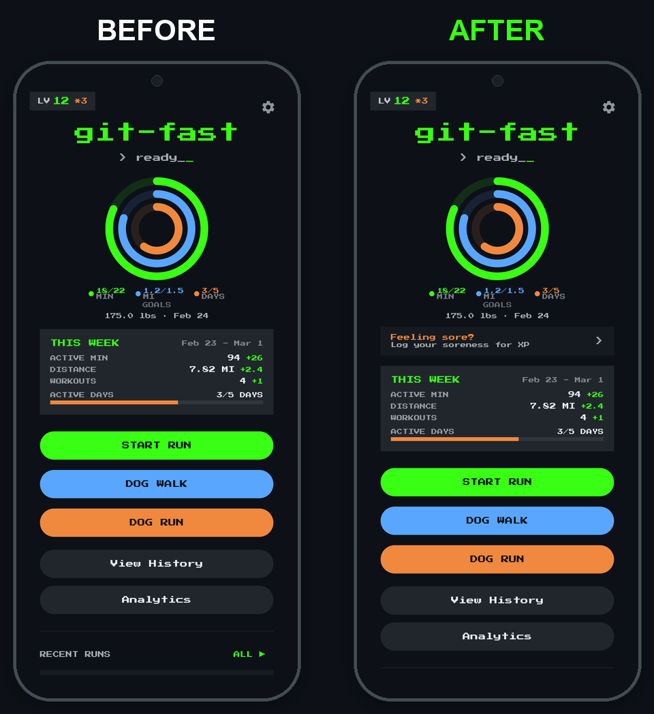 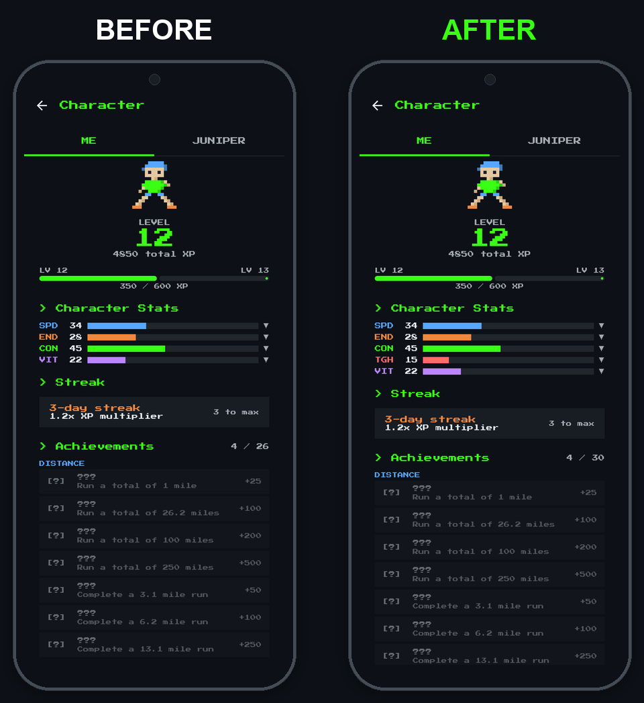  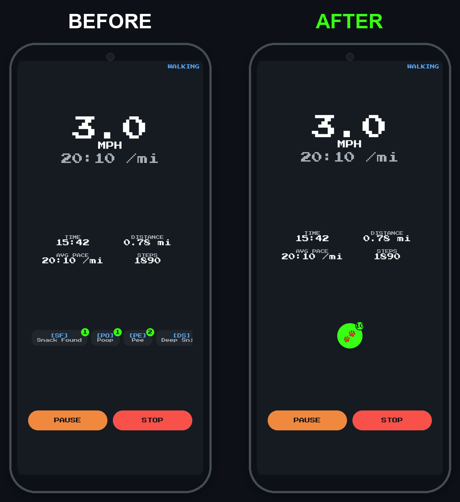 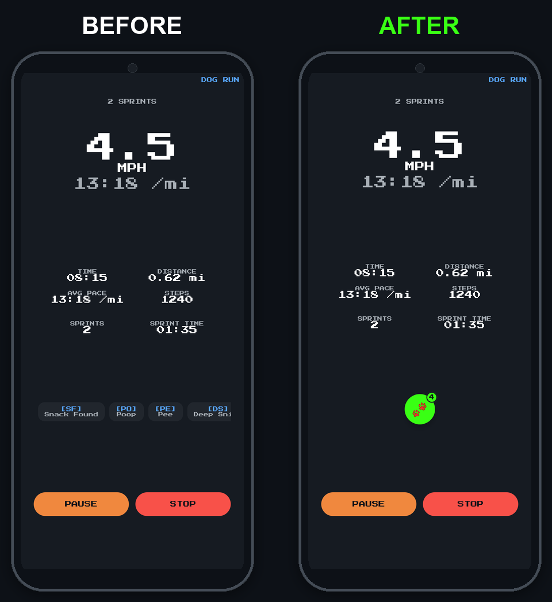 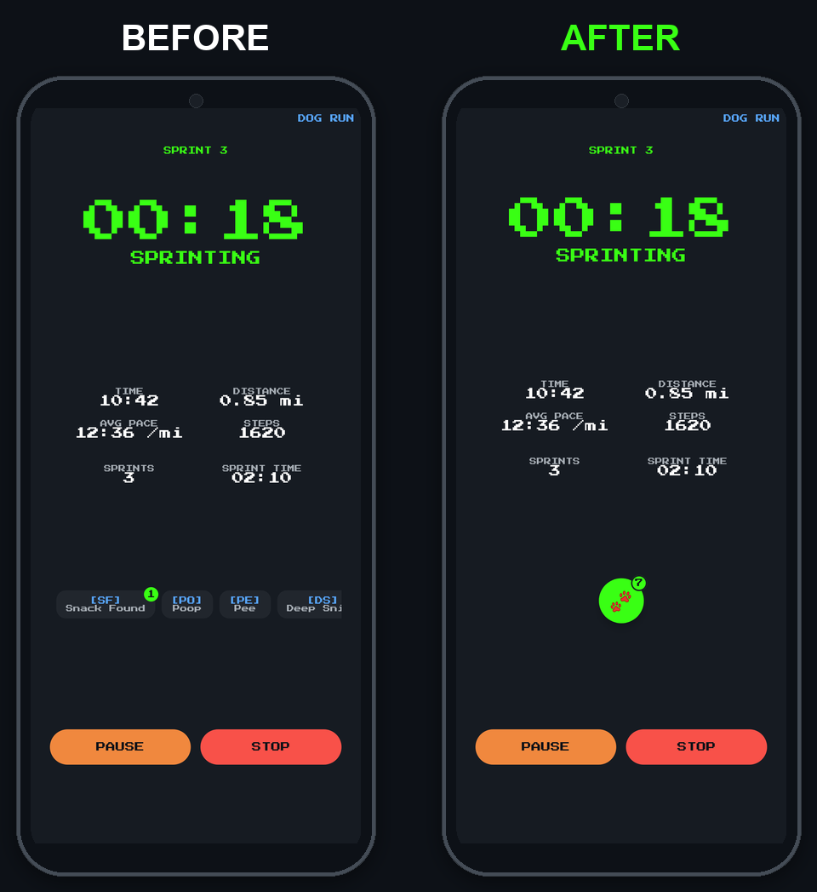 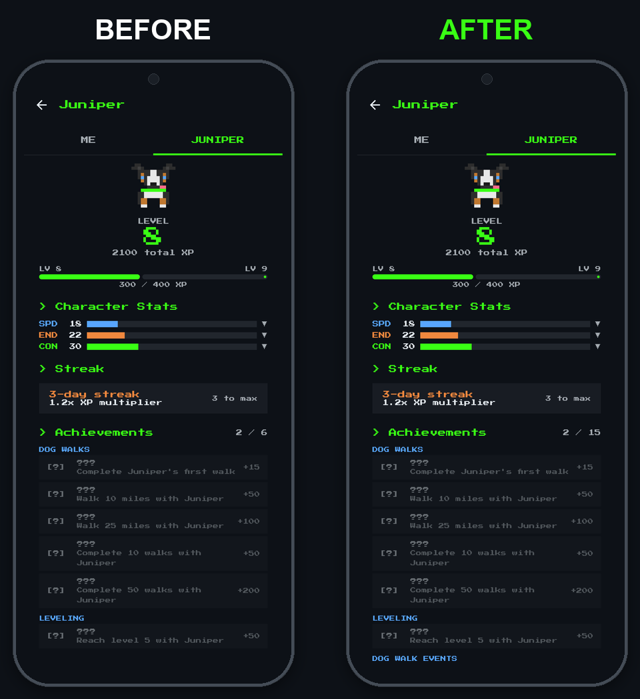 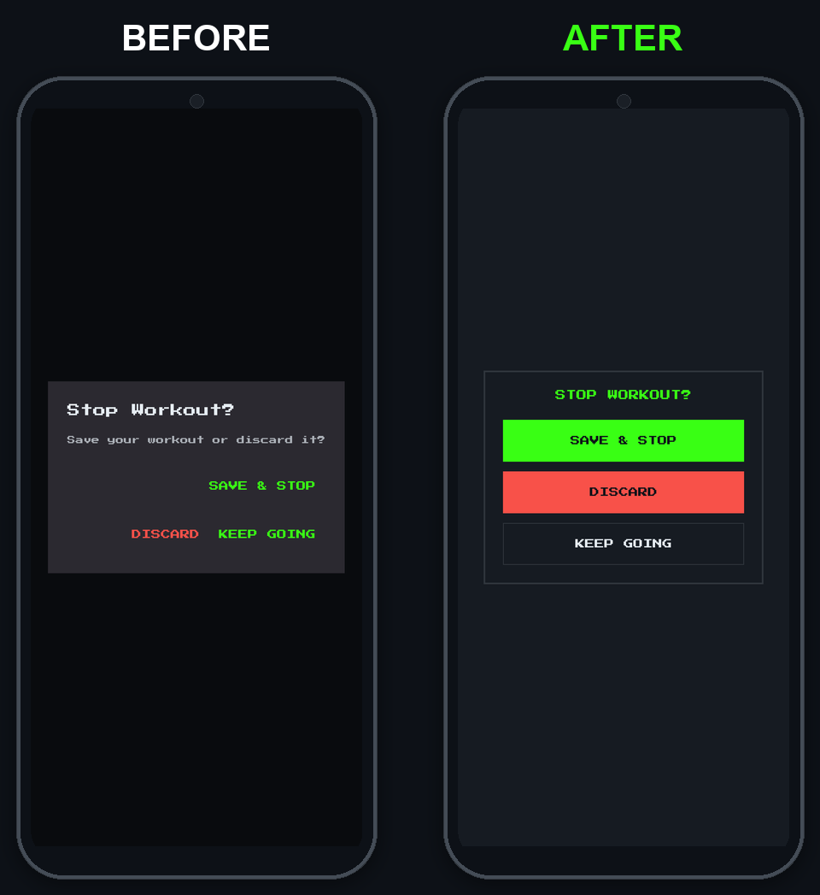 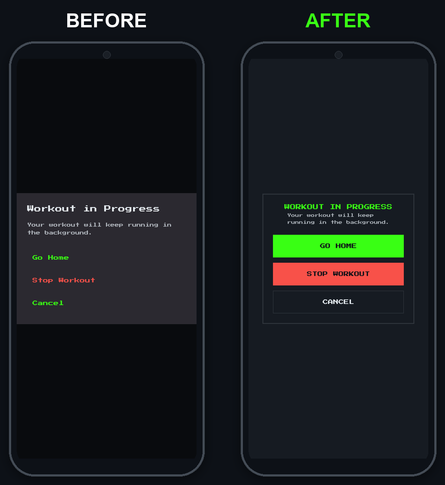 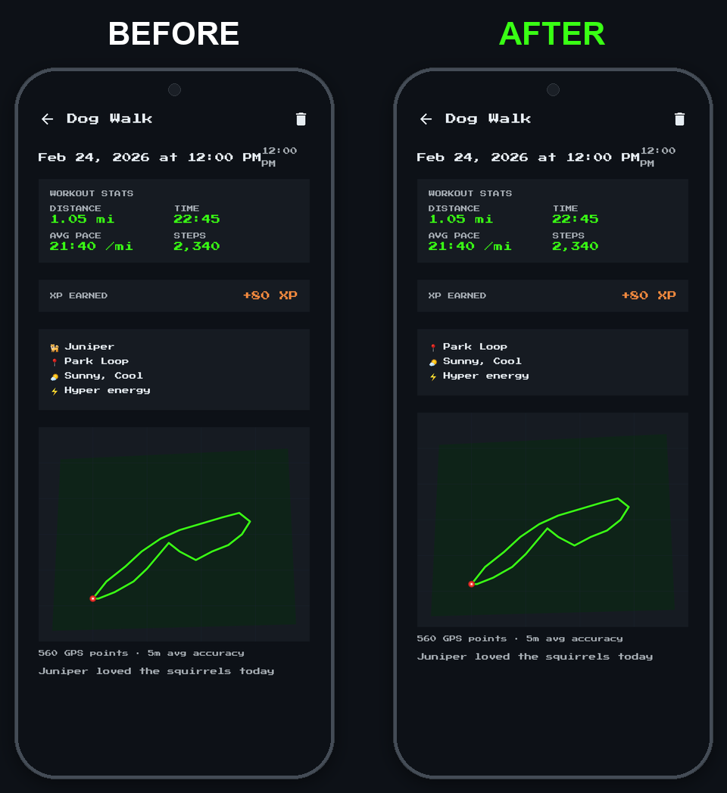 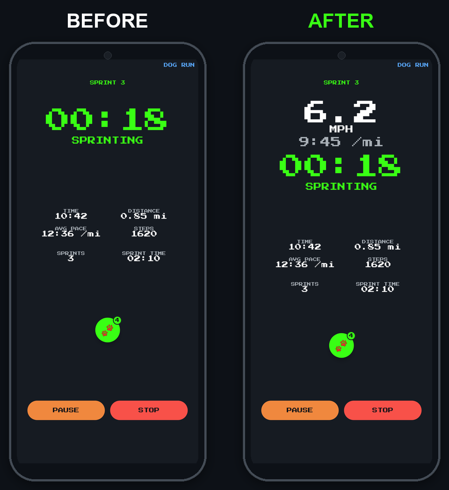

### Highlights
- Dog walk event logger (Juniper's Adventure Log) with emoji map markers
- Radial event wheel FAB replacing the event strip
- Weekly summary card on home screen
- Exercise data model with RPG stat integration
- Soreness check-in system with toughness stat
- Status bar chronometer showing workout time
- Epic narrative rewrite across the app

### Metrics
- **Total PRs Merged:** 100
- **Checkpoints Completed:** 23
- **Screenshot Comparisons:** 6 dated folders
- **Event Types:** Dog walk events with emoji markers

---

## Phase: Security Hardening & Test Coverage
**Date:** Mar 1, 2026 to Mar 2, 2026
**Duration:** 2 days

Shifted focus from features to foundations. Ran a full OWASP Top 10 security audit and fixed every finding — removed PII logging, hardcoded coordinates, disabled Android backup, added Firestore security rules, enabled R8 with ProGuard, and hardened CI. Wrote 114 new unit tests across 8 packages, pushing coverage from patchy to solid. Dependency bumps via Dependabot, custom notification icon, and CI fixes for fork PRs.

### Highlights
- Full OWASP security audit with all findings resolved
- Firestore security rules and R8/ProGuard obfuscation enabled
- 114 new unit tests across 8 packages (mappers, repos, settings)
- CI hardened: Dependabot support, fallback google-services.json
- Custom running man notification icon
- Character sheet polish and activity goals page removed

### Metrics
- **PRs Merged (this phase):** 16
- **New Unit Tests:** 114
- **Security Findings Fixed:** All (PII logging, hardcoded coords, backup, sign-out cleanup)
- **Dependencies Updated:** 6 (via Dependabot)

---

## Phase: Observability, Optimization & New Features
**Date:** Mar 2, 2026 to Mar 3, 2026
**Duration:** 2 days

Added production-grade observability with Crashlytics, Timber structured logging, and persistent file logging. Optimized performance by fixing O(n^2) GPS processing, adding batch DAO queries, and deduplicating UI. Built multi-park lap start points that auto-save locations. Added FOR and STR stats to the character sheet. Shipped an in-app screenshot capture overlay for field testing, and restructured the screenshot directory for long-term organization.

### Highlights
- Crashlytics crash reporting, Timber logging, persistent file logs
- Performance optimization: batch queries, O(n^2) GPS fix, UI dedup
- Dog walk narrative persisted to database
- Multi-park lap start points with auto-save
- FOR and STR stats displayed on character sheet
- In-app screenshot capture with floating overlay button
- Screenshot directory restructured (current/ + history/)
- T-Watch S3 firmware docs extracted to watch/CLAUDE.md

### Metrics
- **Total PRs Merged:** 130
- **PRs Merged (this phase):** 14
- **Observability:** Crashlytics + Timber + file logging
- **New RPG Stats:** FOR (Fortitude) and STR (Strength) on character sheet
