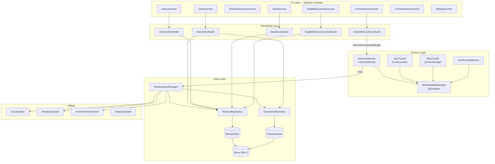
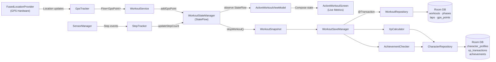
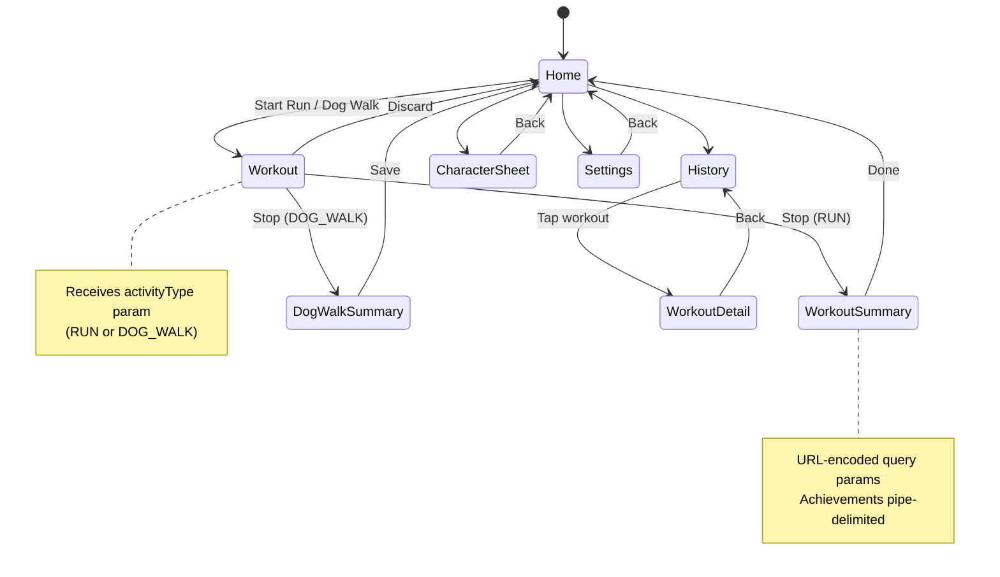
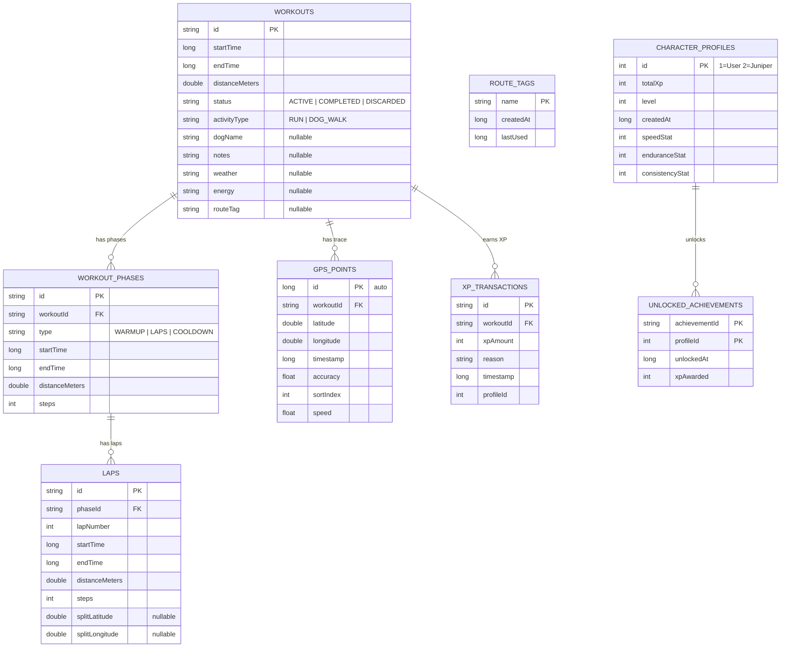
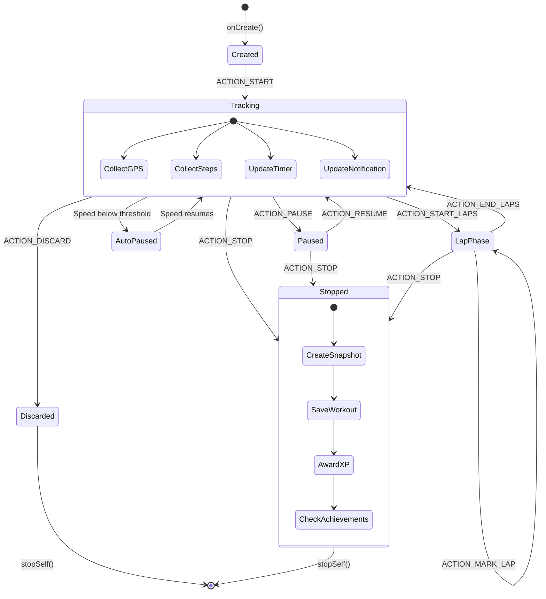
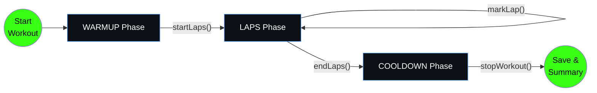
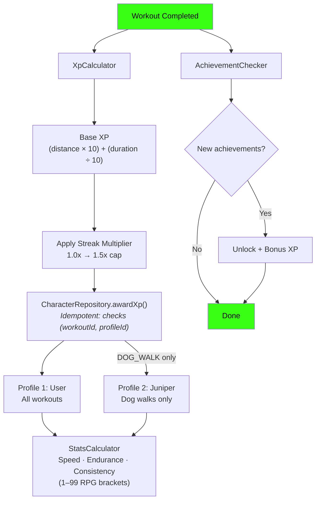
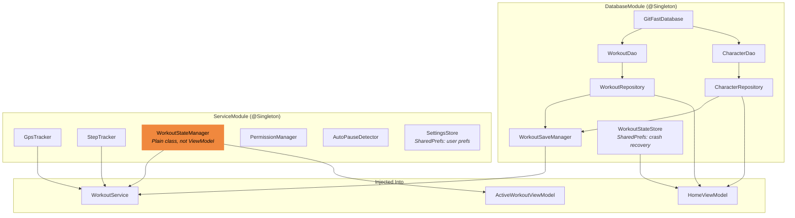

# git-fast

A native Android running & workout tracker with RPG gamification. Track GPS during runs and dog walks, earn XP, level up your character, and unlock achievements.

**Package:** `com.gitfast.app` | **Min SDK** 26 | **Target SDK** 35 | **Kotlin** 2.1.0 | **Compose** + Material3

---

## Architecture Overview



---

## Data Flow — GPS to Persistence



---

## Navigation Graph



---

## Database Schema



---

## Service Lifecycle



---

## Workout Phase Flow



---

## RPG & XP System



---

## Dependency Injection



> **Key pattern:** `WorkoutStateManager` is a plain `@Singleton` (not a ViewModel). It's injected into both `WorkoutService` and `ActiveWorkoutViewModel` so they share the same in-memory state. The ViewModel connects to the service via `ServiceConnection`/`WorkoutBinder`.

---

## Build

```bash
./gradlew assembleDebug          # Build debug APK
./gradlew testDebugUnitTest      # Run unit tests
```

Requires `MAPS_API_KEY` in `local.properties` for Google Maps features.
